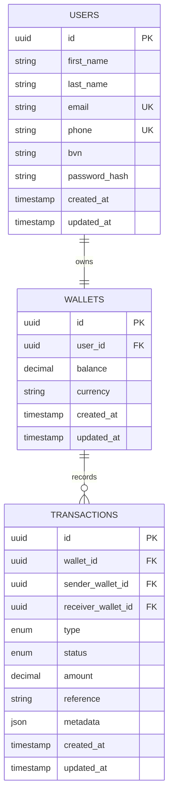

# Lendsqr Wallet API

Production-minded MVP wallet service for the Lendsqr backend engineering assessment.

## Features

- User onboarding with password hashing and wallet auto-creation
- Faux token authentication with `Authorization: Bearer <user_id>`
- Adjutor Karma blacklist check during onboarding
- Wallet funding, transfers, and withdrawals using Knex transactions
- Transaction history for the authenticated user's wallet
- Request validation with Joi and centralized error responses
- Jest + Supertest coverage for positive and negative API flows

## Tech Stack

- Node.js LTS
- TypeScript
- Express.js
- KnexJS
- MySQL
- Jest + Supertest

## ER Diagram



## Database Tables

- `users`: `id`, `first_name`, `last_name`, `email`, `phone`, `bvn`, `password_hash`, `created_at`, `updated_at`
- `wallets`: `id`, `user_id`, `balance`, `currency`, `created_at`, `updated_at`
- `transactions`: `id`, `wallet_id`, `sender_wallet_id`, `receiver_wallet_id`, `type`, `status`, `amount`, `reference`, `metadata`, `created_at`, `updated_at`

## Local Setup

1. Install dependencies:
   `npm install`
2. Create environment file:
   `cp .env.example .env`
3. Create MySQL databases:
   ```sql
   CREATE DATABASE lendsqr_wallet;
   CREATE DATABASE lendsqr_wallet_test;
   ```
4. Update `.env` with database and Adjutor credentials.
5. Run migrations:
   `npm run migrate`
6. Start development server:
   `npm run dev`

## Environment Variables

```env
PORT=4000
NODE_ENV=development

DB_HOST=127.0.0.1
DB_PORT=3306
DB_USER=root
DB_PASSWORD=password
DB_NAME=lendsqr_wallet

TEST_DB_HOST=127.0.0.1
TEST_DB_PORT=3306
TEST_DB_USER=root
TEST_DB_PASSWORD=password
TEST_DB_NAME=lendsqr_wallet_test

ADJUTOR_BASE_URL=https://api.adjutor.io
ADJUTOR_API_KEY=your_adjutor_api_key
```

## Scripts

- `npm run dev`: start the API with `ts-node-dev`
- `npm run build`: compile TypeScript to `dist`
- `npm start`: run the compiled app
- `npm test`: run Jest/Supertest tests
- `npm run typecheck`: run TypeScript without emitting files
- `npm run migrate`: apply migrations
- `npm run migrate:rollback`: roll back the latest migration batch
- `npm run migrate:make -- <name>`: create a migration

## Authentication

Protected routes use faux token authentication:

```http
Authorization: Bearer <user_id>
```

The middleware looks up the user by ID and attaches it to the request.

## API Documentation

Base URL: `/api/v1`

Interactive Swagger docs are available after starting the server:

- `http://localhost:4000/docs`
- `http://localhost:4000/docs.json`

Use the Swagger page to inspect every endpoint, view request/response schemas, and send test requests from the browser. For protected routes, first call `POST /api/v1/users`, copy the returned `data.token`, click **Authorize** in Swagger, and paste the token value. Swagger will send it as:

```http
Authorization: Bearer <token>
```

The raw OpenAPI document at `/docs.json` can also be imported into Postman or another API client.

### Health

`GET /health`

Returns service status.

### Create User

`POST /api/v1/users`

```json
{
  "firstName": "Ada",
  "lastName": "Lovelace",
  "email": "ada@example.com",
  "phone": "08010000000",
  "bvn": "12345678901",
  "password": "secret1"
}
```

Creates a user, blocks blacklisted identities, auto-creates a wallet, and returns a faux token.

### Get Authenticated User

`GET /api/v1/users/me`

Requires `Authorization` header.

### Get Wallet

`GET /api/v1/wallets/me`

Requires `Authorization` header.

### Fund Wallet

`POST /api/v1/wallets/fund`

```json
{
  "amount": 5000,
  "reference": "wallet-ref-001"
}
```

### Transfer Funds

`POST /api/v1/wallets/transfer`

```json
{
  "receiverUserId": "receiver-user-uuid",
  "amount": 1500,
  "reference": "transfer-ref-001"
}
```

### Withdraw Funds

`POST /api/v1/wallets/withdraw`

```json
{
  "amount": 1000,
  "reference": "withdrawal-ref-001"
}
```

### List Transactions

`GET /api/v1/transactions`

Requires `Authorization` header.

## Architecture Decisions

- Controllers are thin and delegate business rules to module services.
- Wallet balance mutations run inside Knex transactions for atomicity and use row-level `forUpdate` locks during balance changes.
- Transfers create debit and credit transaction rows with a shared reference.
- Joi middleware validates and strips unknown payload fields before controllers run.
- Adjutor integration is isolated in `src/services/adjutor.service.ts`.
- The wallet ledger uses an object-oriented `WalletLedgerService` class to encapsulate balance mutation rules, transaction creation, and private wallet lookup helpers.
- Tests mock service boundaries for fast API coverage without requiring a live MySQL instance.

## Assessment Coverage

- Code quality and DRY: shared middleware handles auth, validation, and errors; wallet balance rules are centralized in `WalletLedgerService`.
- Attention to detail: protected routes use authenticated `/me` semantics, responses avoid exposing `password_hash`, and transaction references are indexed but not globally unique so transfer ledger rows can share one reference.
- Best-practice architecture: feature modules keep controllers, services, routes, and validation close to the resource they serve.
- Unit/API testing: Jest + Supertest cover account creation, wallet auto-creation, funding, transfer, withdrawal, transactions, blacklist rejection, duplicate users, invalid auth, missing auth, insufficient funds, and invalid payloads.
- Commit history: commits are split by setup, schema, API implementation, tests, documentation, Swagger docs, and fixes.
- README quality: setup, environment variables, scripts, ER diagram, API documentation, Swagger usage, architecture decisions, and deployment notes are included.
- Folder organization: `src/config`, `src/database`, `src/middlewares`, `src/modules`, `src/services`, `src/utils`, and `tests` separate concerns clearly.
- Naming and conventions: route handlers, services, validation schemas, and database fields use consistent resource-oriented names.
- Semantic paths: routes use `/api/v1/users`, `/api/v1/users/me`, `/api/v1/wallets/me`, `/api/v1/wallets/fund`, `/api/v1/wallets/transfer`, `/api/v1/wallets/withdraw`, and `/api/v1/transactions`.
- OOP usage: `AppError` models HTTP-aware application errors, and `WalletLedgerService` encapsulates wallet ledger behavior with public methods and private helpers.
- Database design: one user owns one wallet, wallets own many transactions, monetary values use decimal columns, and lookup/uniqueness constraints are defined in migrations.
- Transaction scoping: funding, withdrawal, and transfer each run in a single Knex transaction; transfer debits, credits, and transaction logs commit or roll back together.

## Deployment Guide

Suitable platforms include Render, Railway, and Fly.io.

1. Provision a MySQL database.
2. Set all variables from `.env.example` in the platform dashboard.
3. For hosted MySQL providers that give a single connection string, set `DATABASE_URL`.
4. Build command: `npm install && npm run build`
5. Release/migration command: `npm run migrate`
6. Start command: `npm start`

Expected deployed URL format:

```txt
https://<candidate-name>-lendsqr-be-test.<platform-domain>
```

For Render blueprints, `render.yaml` is configured with the service name:

```txt
bhnprksh222-lendsqr-be-test
```

That gives this URL format after deployment:

```txt
https://bhnprksh222-lendsqr-be-test.onrender.com
```
